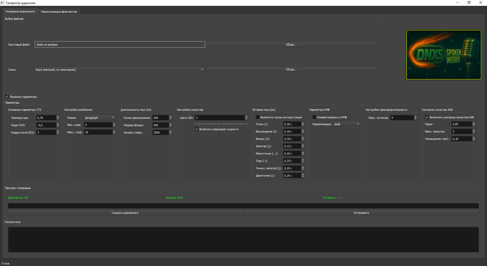
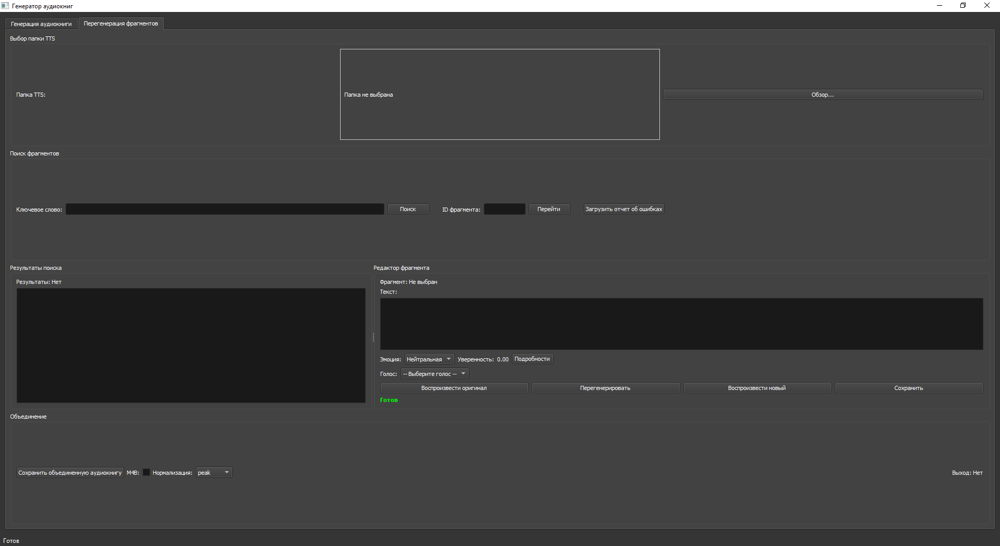

# Pocket-TTS-Spokenword (Русская версия)

<p align="center">
  
</p>

**Генератор аудиокниг с эмоциональным анализом для русского языка**

Это форк проекта [Pocket-TTS-Spokenword](https://github.com/danneauxs/Pocket-TTS-Spokenword), адаптированный для русскоязычной аудитории с использованием Silero TTS и RuBERT для анализа эмоций.

---

## 🎯 Основные возможности

- ✅ **Русский язык**: Высококачественный синтез речи через Silero TTS
- ✅ **Анализ эмоций**: Автоматическое определение эмоций в русском тексте (RuBERT)
- ✅ **5 голосов**: 2 мужских (aidar, eugene) и 3 женских (baya, kseniya, xenia)
- ✅ **Умное разбиение**: Интеллектуальная сегментация текста по предложениям/абзацам
- ✅ **Распознавание структуры**: Автоматическое определение глав, частей, разделов
- ✅ **GUI интерфейс**: Удобное графическое приложение на русском языке
- ✅ **Форматы**: WAV и M4B (аудиокнига)
- ✅ **Работает на CPU**: Не требует GPU, быстрая генерация
- ✅ **Портативная установка**: Всё в одной папке (Windows)

---

## 📋 Что было изменено по сравнению с оригиналом

### Замена TTS модели
- **Было**: Pocket TTS (английский, требует GPU)
- **Стало**: Silero TTS (русский, оптимизирован для CPU)

### Замена модели эмоций
- **Было**: DistilRoBERTa (английский, 7 эмоций)
- **Стало**: RuBERT (русский, 6 эмоций: радость, грусть, удивление, страх, гнев, нейтральная)

### Обработка текста
- Добавлена поддержка русских паттернов глав: "Глава", "Часть", "Раздел", "Книга", "Пролог", "Эпилог"
- Автоматическое определение кодировки (UTF-8, Windows-1251, CP1251, KOI8-R)

### Интерфейс
- Полностью переведен на русский язык
- Добавлены подсказки (tooltips) для всех элементов управления
- Адаптированы названия голосов и параметров

### Установка
- Создан `install.bat` для портативной установки на Windows
- Создан `start.bat` для запуска без активации окружения
- Всё устанавливается в папку `.portable` внутри проекта

---

## 🚀 Быстрый старт

### Требования
- **Windows 10/11** (для портативной установки)
- **Python 3.10-3.12** (устанавливается автоматически)
- **~2 GB свободного места** (для зависимостей и моделей)
- **Интернет** (для первой загрузки моделей)

### Установка

1. **Скачайте проект**
   ```bash
   git clone https://github.com/mrtek/Pocket-TTS-Spokenword-RUS
   cd Pocket-TTS-Spokenword
   ```

2. **Запустите установку**
   ```batch
   install.bat
   ```
   
   Это установит:
   - Портативный Python 3.12
   - Все необходимые библиотеки
   - Silero TTS (~59 MB, скачается при первом запуске)
   - RuBERT для анализа эмоций (~100 MB, скачается при первом запуске)

3. **Запустите программу**
   ```batch
   start.bat
   ```

### Первый запуск

При первом запуске программа автоматически скачает модели:
- **Silero TTS** (~59 MB) - для генерации речи
- **RuBERT** (~100 MB) - для анализа эмоций

Это займет 2-5 минут в зависимости от скорости интернета.

---

## 📖 Использование

### Основной интерфейс

<p align="center">
  
</p>

#### 1. Выбор файлов
- **Текстовый файл**: Выберите `.txt` файл с русским текстом
- **Голос**: Выберите один из 5 доступных голосов:
  - `baya` - женский (по умолчанию)
  - `aidar` - мужской
  - `eugene` - мужской
  - `kseniya` - женский
  - `xenia` - женский

#### 2. Параметры (опционально)

Нажмите "Показать параметры" для доступа к расширенным настройкам:

**Основные параметры TTS:**
- **Температура** (0.5-0.9): Вариативность речи. Выше = более разнообразная интонация
- **Порог EOS** (-10.0 до 0.0): Определение конца фразы. Ниже = более длинные фразы
- **Кадры после EOS** (0-10): Пауза после фразы

**Настройки разбиения:**
- **Режим**: `sentence` (по предложениям) или `paragraph` (по абзацам)
- **Мин. слов**: Минимальная длина фрагмента
- **Макс. слов**: Максимальная длина фрагмента (рекомендуется 60-100)

**Длительность пауз (мс):**
- **Конец предложения**: 200 мс (по умолчанию)
- **Разрыв абзаца**: 600 мс
- **Начало главы**: 2000 мс

**Параметры M4B:**
- **Конвертировать в M4B**: Создать файл аудиокниги (меньший размер)
- **Нормализация**: `peak` (рекомендуется), `loudness`, `simple`, `none`

**Настройки производительности:**
- **Макс. потоков**: Количество параллельных потоков (рекомендуется: количество ядер - 1)

#### 3. Генерация

1. Нажмите **"Создать аудиокнигу"**
2. Следите за прогрессом в секции "Прогресс генерации"
3. Результат сохранится в папку `Output/[имя_файла]/`

### Перегенерация фрагментов

<p align="center">
  
</p>

Вкладка "Перегенерация фрагментов" позволяет:
- Искать фрагменты по ключевым словам или ID
- Редактировать текст фрагмента
- Изменять эмоцию
- Перегенерировать отдельные фрагменты
- Прослушивать оригинал и новую версию
- Сохранять изменения
- Объединять все фрагменты в финальную аудиокнигу

---

## ⚙️ Рекомендуемые настройки

### Для художественной литературы
```yaml
Температура: 0.7-0.8
Режим разбиения: sentence
Макс. слов: 80
Конец предложения: 300 мс
Разрыв абзаца: 800 мс
Включить вариацию скорости: ✓
```

### Для технической литературы
```yaml
Температура: 0.6
Режим разбиения: paragraph
Макс. слов: 120
Конец предложения: 200 мс
Разрыв абзаца: 600 мс
Включить вариацию скорости: ✗
```

### Для детских книг
```yaml
Температура: 0.8-0.9
Режим разбиения: sentence
Макс. слов: 60
Конец предложения: 400 мс
Разрыв абзаца: 1000 мс
Включить вариацию скорости: ✓
```

---

## 🎭 Поддерживаемые эмоции

RuBERT определяет 6 эмоций в русском тексте:

| Эмоция | Описание | Влияние на речь |
|--------|----------|-----------------|
| **Радость** | Позитивные эмоции, восторг | Быстрее (+15%) |
| **Грусть** | Печаль, уныние | Медленнее (-15%) |
| **Удивление** | Неожиданность | Быстрее (+10%) |
| **Страх** | Тревога, беспокойство | Медленнее (-10%) |
| **Гнев** | Злость, раздражение | Быстрее (+10%) |
| **Нейтральная** | Спокойное повествование | Нормальная скорость |

---

## 📁 Структура выходных файлов

После генерации в папке `Output/[имя_файла]/` будут созданы:

```
Output/
└── название_книги/
    ├── TTS/
    │   ├── audio_chunks/          # Отдельные аудио фрагменты
    │   │   ├── chunk_00000.wav
    │   │   ├── chunk_00001.wav
    │   │   └── ...
    │   ├── text_chunks/           # Метаданные фрагментов
    │   │   ├── audiobook.chunks.json
    │   │   ├── chunk_00000.txt
    │   │   └── ...
    │   └── название_книги.debug.log
    ├── название_книги [голос].wav  # Финальная аудиокнига (WAV)
    └── название_книги [голос].m4b  # Финальная аудиокнига (M4B, если включено)
```

---

## 🔧 Устранение неполадок

### Программа не запускается
**Решение:**
```batch
rmdir /s /q .venv
rmdir /s /q .portable
install.bat
```

### Ошибка "Failed to load Silero TTS model"
**Причина:** Нет интернета или проблемы с GitHub  
**Решение:** Проверьте подключение к интернету и повторите попытку

### Ошибка кодировки текста
**Причина:** Неподдерживаемая кодировка файла  
**Решение:** Пересохраните текстовый файл в кодировке UTF-8 или Windows-1251

### Голос не меняется
**Причина:** Модель уже загружена с другим голосом  
**Решение:** Перезапустите программу через `start.bat`

### Медленная генерация
**Решение:**
- Увеличьте "Макс. потоков" в настройках производительности
- Уменьшите "Макс. слов" в настройках разбиения
- Отключите "Контроль качества ASR" (если включен)

### Цифры читаются неправильно
**Ограничение Silero:** Модель плохо читает цифры  
**Решение:** Замените цифры на слова в тексте:
- `123` → `сто двадцать три`
- `2024` → `две тысячи двадцать четыре`

---

## 🆚 Сравнение с оригинальным Pocket TTS

| Характеристика | Оригинал | Русская версия |
|----------------|----------|----------------|
| **Язык** | Английский | Русский |
| **TTS модель** | Pocket TTS | Silero TTS |
| **Требования** | GPU (CUDA) | CPU |
| **Размер модели** | ~500 MB | ~59 MB |
| **Скорость** | Зависит от GPU | Быстрее реального времени на CPU |
| **Голоса** | 8 (английские) | 5 (русские) |
| **Voice cloning** | ✓ | ✗ (ограничение Silero) |
| **Эмоции** | 7 (английские) | 6 (русские) |
| **Интерфейс** | Английский | Русский |
| **Установка** | Требует настройки | Портативная (Windows) |

---

## 📜 Лицензия

Apache License 2.0 - см. файл [LICENSE](LICENSE)

Этот проект является форком [Pocket-TTS-Spokenword](https://github.com/danneauxs/Pocket-TTS-Spokenword), который в свою очередь основан на [Pocket TTS от Kyutai Labs](https://github.com/kyutai-labs/pocket-tts).

---

## 🙏 Благодарности

- **Kyutai Labs** - за оригинальную модель Pocket TTS
- **danneauxs** - за Pocket-TTS-Spokenword с эмоциональным анализом
- **Silero Team** - за отличную русскую TTS модель
- **Cointegrated** - за RuBERT модель анализа эмоций

---

## 📊 Системные требования

### Минимальные
- **ОС**: Windows 10 (64-bit)
- **CPU**: 2 ядра, 2.0 GHz
- **RAM**: 4 GB
- **Диск**: 3 GB свободного места
- **Интернет**: Для первой загрузки моделей

### Рекомендуемые
- **ОС**: Windows 11 (64-bit)
- **CPU**: 4+ ядра, 3.0+ GHz
- **RAM**: 8+ GB
- **Диск**: 5+ GB свободного места (SSD)
- **Интернет**: Широкополосный

